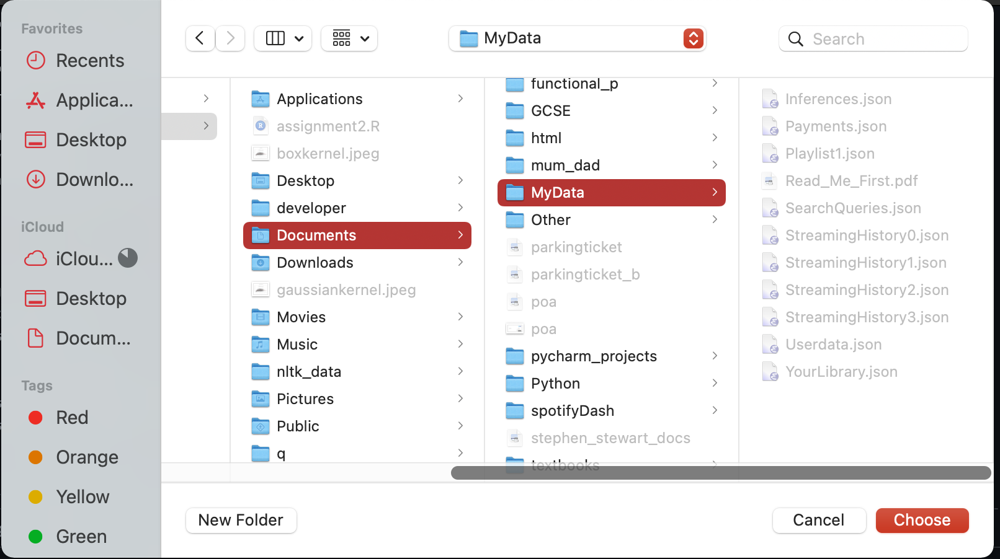

# SPOTIFY DASHBOARD GENERATOR

## PURPOSE
This project creates a dashboard displaying your spotify listening habits over the last year.

## REQUIREMENTS

### System
- `python3` is installed.
- Port 8050 is free on your (local) machine.

### Python packages
- `dash`: https://pypi.org/project/dash/
- `pillow`: https://pillow.readthedocs.io/en/stable/installation.html
- `beautifulsoup4`: https://pypi.org/project/beautifulsoup4/
- `requests`: https://pypi.org/project/requests/
- `pandas`: https://pypi.org/project/pandas/
- `regex`: https://pypi.org/project/regex/
- `numpy`: https://pypi.org/project/numpy/
- `plotly`: https://pypi.org/project/plotly/

## USAGE

### 1. Clone this repository

### 2. Get your streaming data from spotify
- Login to spotify.
- In the dropdown on your spotify icon in the top right of the screen select `Account`.
- Select `Privacy Settings` on the left-hand-side menu.
- Follow the instructions under `Download your data` (at the bottom of the web page).
- Your personal data will be sent to you as a download link in your email.

### 3. Generate dashboard
- From terminal run `python3 app.py`.
- Select the path to the unzipped `MyData` directory.
- Sit back and wait!

## EXAMPLE USAGE
```
user@host Documents % git clone https://github.com/sstewart0/spotifyDash
user@host Documents % cd spotifyDash
user@host spotifyDash % ls
README.md		app.py			dashboard.py
analysis.py		assets			spotify_dash.png

user@host spotifyDash % pip install dash pillow beautifulsoup4 requests pandas regex numpy plotly
user@host spotifyDash % python3 app.py
```



